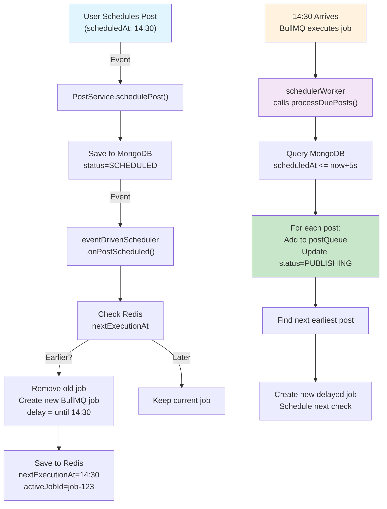
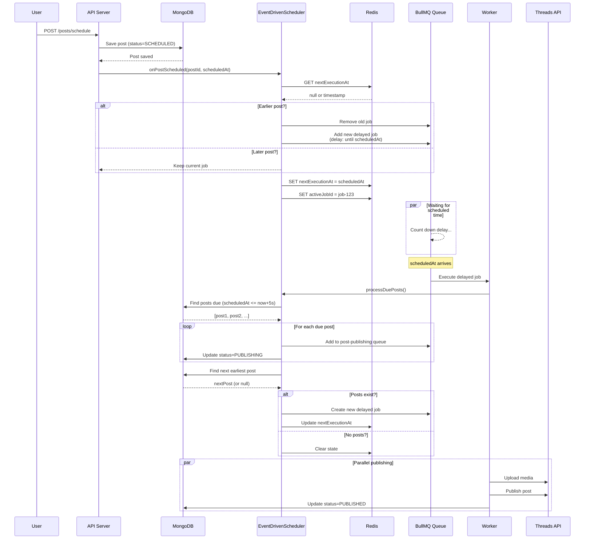
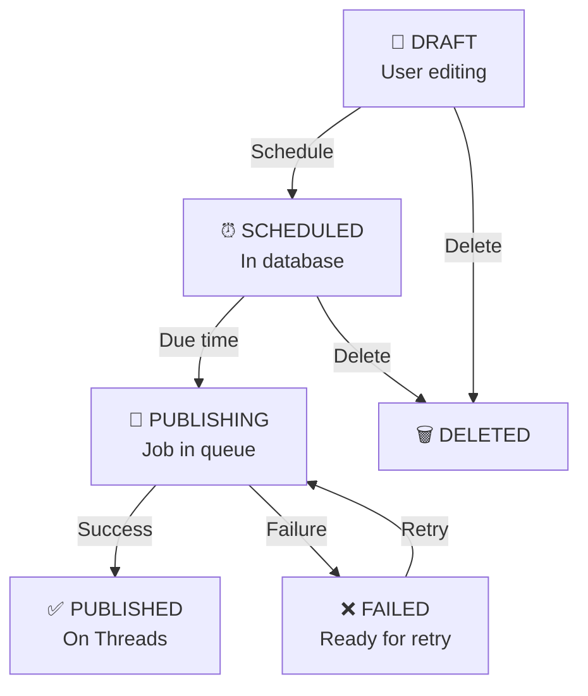
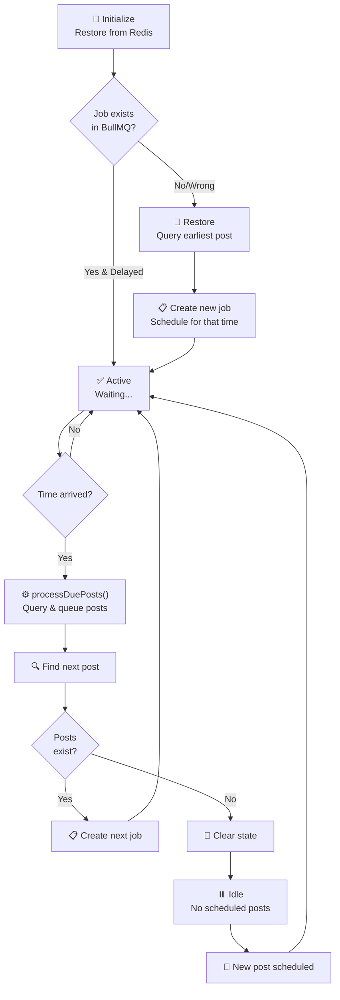

# Architecture & Implementation Guide

Complete reference for the Threads Auto-Post system architecture, scheduling mechanism, and key components.

## Table of Contents

1. [System Overview](#system-overview)
2. [Event-Driven Scheduling](#event-driven-scheduling)
3. [Architecture Diagrams](#architecture-diagrams)
4. [Key Components](#key-components)
5. [Setup & Configuration](#setup--configuration)
6. [Testing & Validation](#testing--validation)
7. [Troubleshooting](#troubleshooting)

---

## System Overview

### What is Threads Auto-Post?

A production-grade, event-driven post scheduling system for Meta Threads that:

- Schedules posts for future publication
- Supports recurring patterns (ONCE, WEEKLY, MONTHLY, DATE_RANGE)
- Reduces database queries by 95% through event-driven scheduling
- Survives server restarts with Redis persistence
- Handles multiple Threads accounts
- Provides comprehensive monitoring and job tracking

### Architecture Stack

```
┌─────────────────────────────────────────────────────────┐
│                   Frontend (React + Vite)               │
│              UI for post creation & monitoring           │
└────────────────────┬────────────────────────────────────┘
                     │ HTTP/REST
┌────────────────────▼────────────────────────────────────┐
│                  Backend (Express.js)                   │
│  ┌────────────────────────────────────────────────┐    │
│  │  PostService    SchedulerService              │    │
│  │  ThreadsAdapter EventDrivenScheduler          │    │
│  │  MonitoringService   IdempotencyService       │    │
│  └────────────────────────────────────────────────┘    │
└────────┬──────────────────────┬──────────────────────────┘
         │                      │
    ┌────▼─────────┐   ┌───────▼──────────┐
    │  MongoDB     │   │   BullMQ Queues  │
    │  (Posts)     │   │  (Jobs)          │
    └──────────────┘   └────┬──────────────┘
                           │
                    ┌──────▼─────────┐
                    │     Redis      │
                    │ (State, Cache) │
                    └────────────────┘
```

---

## Event-Driven Scheduling

### Core Problem & Solution

**Old Approach (Polling)**:

```
Every 60 seconds:
  Query DB → Check for due posts → Wait 60s → Repeat

Result: 1,440 queries/day, up to 60s delay
```

**New Approach (Event-Driven)**:

```
User schedules post
  → Trigger event
  → Create BullMQ delayed job
  → BullMQ executes EXACTLY when needed

Result: 10-50 queries/day, 0-5s delay, zero polling
```

### How It Works



### Key Concepts

#### 1. Batch Window (5 seconds)

Posts due within 5 seconds are processed together:

```
Current: 14:30:00.000
Window: 14:30:00.000 → 14:30:05.000

Posts to process:
  ✓ 14:30:00 (1000ms overdue)
  ✓ 14:30:03 (3000ms overdue)
  ✓ 14:30:04.999 (4999ms overdue)
  ✗ 14:30:05.001 (next batch)
```

Configurable: `SCHEDULER_BATCH_WINDOW_MS=5000`

#### 2. Redis State Persistence

```
scheduler:nextExecutionAt    = 1735312200000  (14:30 timestamp)
scheduler:activeJobId         = scheduler-check-1735312200000
scheduler:lastCheck          = 1735312150000  (previous check)
```

Survives restarts: On startup, `initialize()` restores from Redis.

#### 3. Idempotent Job Creation

```javascript
// Same scheduledAt = Same job ID = No duplicates
const jobId = `scheduler-check-${checkTimestamp}`;

// BullMQ automatically deduplicates
await schedulerQueue.add("check-due-posts", data, { jobId });
```

---

## Architecture Diagrams

### Post Publishing Flow



### Job Queue States



### Scheduler State Machine



---

## Key Components

### PostService

**File**: `src/services/PostService.ts`

**Responsibilities**:

- CRUD operations on posts
- Post validation
- Schedule management
- Emit scheduler events

**Key Methods**:

```typescript
async createPost(data): Promise<IPost>
async updatePost(id, data): Promise<IPost>
async deletePost(id): Promise<void>
async schedulePost(postId, config): Promise<IPost>
async getPosts(filters): Promise<{ posts, total }>
```

**Event Emissions**:

```typescript
// When post is scheduled
await eventDrivenScheduler.onPostScheduled(postId, scheduledAt);

// When post is deleted
await eventDrivenScheduler.onPostCancelled(postId);
```

### EventDrivenScheduler

**File**: `src/services/EventDrivenScheduler.ts`

**Responsibilities**:

- Zero-poll scheduling
- Redis state management
- Event handling
- Job processing

**Key Methods**:

```typescript
async initialize(): Promise<void>
async onPostScheduled(postId, scheduledAt): Promise<void>
async onPostCancelled(postId): Promise<void>
async processDuePosts(): Promise<void>
async scheduleNextCheck(): Promise<void>
```

**Processing Pipeline**:

```
processDuePosts()
  ├─ Query due posts (scheduledAt <= now + BATCH_WINDOW_MS)
  ├─ For each post:
  │   ├─ Check if one-time or recurring
  │   ├─ Generate job ID (idempotent)
  │   ├─ Add to postQueue
  │   └─ Update status → PUBLISHING
  ├─ Find next earliest post
  └─ Schedule new delayed job
```

### BullMQ Queues

**Two Separate Queues**:

#### 1. `post-publishing` Queue

- **Purpose**: Publish posts to Threads API
- **Jobs**: `publish-post` with `{ postId }`
- **Concurrency**: 5 (configurable via `WORKER_CONCURRENCY`)
- **Retries**: 3 with exponential backoff
- **Worker**: `worker.ts` processor

#### 2. `scheduler-meta` Queue

- **Purpose**: Scheduler meta-jobs
- **Jobs**: `check-due-posts` with `{ checkTime }`
- **Concurrency**: 1 (only one check at a time)
- **Retries**: 3
- **Worker**: `worker.ts` scheduler worker

### ThreadsAdapter

**File**: `src/adapters/ThreadsAdapter.ts`

**Responsibilities**:

- Threads API integration
- Media upload
- Post publishing
- Comment posting

**Methods**:

```typescript
async publishPost(post): Promise<{ threadsPostId, ... }>
async uploadMedia(url): Promise<{ mediaId }>
async postComment(threadsPostId, comment): Promise<{ commentId }>
```

### MonitoringService

**File**: `src/services/MonitoringService.ts`

**Responsibilities**:

- Queue health monitoring
- Job statistics
- Scheduled post visibility

**Key Methods**:

```typescript
async getQueueHealth(): Promise<HealthData>
async getQueueStats(): Promise<StatsData>
async getRecentJobs(limit): Promise<RecentJobsData>
async getScheduledPosts(): Promise<JobRecord[]>
```

---

## Setup & Configuration

### Environment Variables

```bash
# Scheduling
USE_EVENT_DRIVEN_SCHEDULER=true        # Enable event-driven (false = polling)
SCHEDULER_BATCH_WINDOW_MS=5000         # Process posts within 5 seconds

# Redis
REDIS_HOST=localhost
REDIS_PORT=6379
REDIS_PASSWORD=

# MongoDB
MONGODB_URI=mongodb://localhost:27017/threads-post-scheduler

# Threads API
THREADS_USER_ID=123456789
THREADS_ACCESS_TOKEN=your-token
THREADS_REFRESH_TOKEN=your-refresh-token

# Job Configuration
WORKER_CONCURRENCY=5
JOB_TIMEOUT=30000
```

### Startup

**API Server**:

```bash
npm run dev      # Starts on port 3001
```

**Worker** (separate process):

```bash
npm run worker   # Starts BullMQ workers
```

**Scheduler Initialization**:

```typescript
// In worker.ts
if (process.env.USE_EVENT_DRIVEN_SCHEDULER === "true") {
  await eventDrivenScheduler.initialize();
  // Restores state, creates delayed job for next due post
}
```

---

## Testing & Validation

### Integration Tests

```bash
# Install test dependencies
npm install --save-dev vitest @vitest/ui

# Run tests
npm run test:integration

# Watch mode
npm run test:watch

# With UI
npm run test:ui
```

**Test Files**:

- `tests/integration/setup.ts` - Test utilities
- `tests/integration/PostService.test.ts` - Post CRUD & scheduling
- `tests/integration/EventDrivenScheduler.test.ts` - Scheduler logic

**Coverage**:

- ✅ Post creation, update, delete
- ✅ Scheduling with all patterns
- ✅ Scheduler initialization & restart
- ✅ Event-driven reschedule logic
- ✅ Batch processing
- ✅ Idempotency

### Manual Testing

```bash
# 1. Create a post
curl -X POST http://localhost:3001/api/posts \
  -H "Content-Type: application/json" \
  -d '{"content": "Test post", "postType": "TEXT"}'

# 2. Schedule it
curl -X POST http://localhost:3001/api/posts/{postId}/schedule \
  -H "Content-Type: application/json" \
  -d '{
    "scheduledAt": "2025-12-27T14:30:00Z",
    "pattern": "ONCE"
  }'

# 3. Check scheduler state
redis-cli GET scheduler:nextExecutionAt
redis-cli GET scheduler:activeJobId

# 4. Monitor
curl http://localhost:3001/api/monitoring/queue

# 5. View logs
npm run worker
# Should show: "⏰ Next check scheduled in 3600s at..."
```

---

## Edge Cases & Handling

### 1. Post Scheduled Before Current Next Execution

**Scenario**: Current job scheduled for 15:00, new post for 14:30

**Handling**:

```
onPostScheduled(post2Id, 14:30)
  ├─ Check Redis: nextExecutionAt = 15:00
  ├─ Compare: 14:30 < 15:00 → Earlier!
  ├─ Remove job scheduled for 15:00
  ├─ Create new job for 14:30
  └─ Update Redis
```

**Result**: ✅ Earlier post published first

### 2. All Scheduled Posts Deleted

**Scenario**: User deletes only scheduled post

**Handling**:

```
onPostCancelled(postId)
  ├─ Query: Any SCHEDULED posts?
  ├─ Result: None
  ├─ Clear Redis state
  └─ No new job created
```

**Result**: ✅ System idle, no wasted job

### 3. Server Crash During Execution

**Scenario**: Worker dies while processing posts

**Handling on Restart**:

```
initialize()
  ├─ Load nextExecutionAt from Redis
  ├─ Check BullMQ job exists
  ├─ If missing: Query earliest post, recreate job
  └─ Resume scheduling
```

**Result**: ✅ No posts lost, automatic recovery

### 4. Recurring Post Rescheduling

**Scenario**: Weekly post publishes, next occurrence next week

**Handling**:

```
processDuePosts() [for weekly post]
  ├─ Publish to Threads
  ├─ Calculate next occurrence (next Monday)
  ├─ Update scheduledAt in MongoDB
  ├─ scheduleNextCheck() finds it
  └─ Creates job for next week
```

**Result**: ✅ Recurring posts self-manage

### 5. Race Condition: Multiple Scheduler Jobs

**Scenario**: Two workers both create scheduler jobs

**Handling**:

```
Job ID = `scheduler-check-{timestamp}`

Worker 1: Add job-1735312200000
BullMQ: ✅ Accepted

Worker 2: Add job-1735312200000
BullMQ: Already exists, skip ✅
```

**Result**: ✅ Idempotent, no duplicates

---

## Troubleshooting

### Problem: Scheduler not running

**Check 1: Redis state**

```bash
redis-cli GET scheduler:nextExecutionAt
redis-cli GET scheduler:activeJobId
```

**Check 2: BullMQ jobs**

```bash
curl http://localhost:3001/api/monitoring/queue/scheduler-meta
```

**Fix**:

```typescript
await eventDrivenScheduler.scheduleImmediateCheck();
```

### Problem: Post not published at scheduled time

**Check 1: Post exists & is SCHEDULED**

```bash
db.posts.findOne({ status: "SCHEDULED" })
```

**Check 2: Worker running**

```bash
npm run worker
# Should show active jobs
```

**Check 3: BullMQ queue has job**

```bash
curl http://localhost:3001/api/monitoring/queue/post-publishing
```

### Problem: Redis connection failed

```bash
# Test Redis
redis-cli ping
# Output: PONG

# Check config
echo $REDIS_HOST
echo $REDIS_PORT
```

### Problem: Multiple scheduler jobs running

**Check**: Job IDs should be identical for same timestamp

```bash
# Each should overwrite previous
const jobId = `scheduler-check-{timestamp}`;
```

---

## Performance Metrics

| Metric               | Polling  | Event-Driven |
| -------------------- | -------- | ------------ |
| DB Queries/hour      | 60       | 1-10         |
| Scheduling Latency   | 0-60s    | 0-5s         |
| CPU Usage            | Constant | 0% when idle |
| Memory               | Low      | Lower        |
| Scales to 10k+ posts | ❌ No    | ✅ Yes       |

---

## Migration from Polling

### Phase 1: Enable alongside polling

```bash
# .env
USE_EVENT_DRIVEN_SCHEDULER=true
```

Monitor logs for any discrepancies.

### Phase 2: Full switch

Remove old `SchedulerService.start()` call from worker.ts.

### Phase 3: Optional rollback

Set `USE_EVENT_DRIVEN_SCHEDULER=false` to instantly revert.

---

## Architecture Summary

The system combines:

- **Event-driven scheduling** for zero-polling efficiency
- **BullMQ delayed jobs** for precise execution timing
- **Redis persistence** for state recovery
- **MongoDB** as source of truth
- **Idempotent operations** for crash-safe semantics
- **Batch processing** for efficiency
- **Modular adapters** for multi-platform support

This design scales to millions of scheduled posts while maintaining sub-second accuracy and near-zero idle overhead.
