# Threads Auto-Post: Business Features & Capabilities

**Document Version**: 1.0  
**Last Updated**: January 2026  
**Status**: Production-Ready

---

## 1. Context

### Product Overview

Threads Auto-Post is a full-stack post scheduling and management platform for Meta Threads. The system enables automated publishing workflows through:

- **Web-based post creation and management** - CRUD operations with rich media support
- **Event-driven scheduling** - BullMQ delayed jobs eliminate database polling
- **Multi-account support** - Manage multiple Threads accounts from single interface
- **Excel bulk operations** - Import and schedule posts from spreadsheet files
- **Background worker processing** - Separate process handles publishing to Threads API
- **Real-time monitoring** - Queue health and job status dashboards

### Core Business Problem

Manual Threads posting at scale is time-consuming and error-prone. The system solves:

- **Scheduling accuracy** - Posts publish at exact scheduled times (±5 seconds)
- **Multi-account overhead** - Single UI manages unlimited Threads accounts
- **Batch operations** - Import and schedule hundreds of posts simultaneously
- **Error recovery** - Automatic retry with exponential backoff
- **24/7 automation** - Background worker publishes posts without human intervention

### Implementation Constraints

- **Timezone**: Hardcoded to `Asia/Ho_Chi_Minh` throughout (DO NOT change without updating all date handling)
- **Architecture**: Turbo monorepo with separate API server and worker processes
- **Post types**: TEXT, IMAGE, CAROUSEL, VIDEO (as defined by Threads API)
- **Scheduling patterns**: ONCE, WEEKLY, MONTHLY, DATE_RANGE
- **Excel format**: Vietnamese column headers with specific normalization rules
- **Worker separation**: Publishing logic runs in separate process from API server

---

## 2. Frontend Implementation

### Core Pages & Containers

**Main Application ([`App.tsx`](apps/frontend/src/App.tsx))**

- Tab navigation: Posts, Control Center, Settings
- URL-based routing with browser history support
- Account context provider wraps entire application

**Posts Manager Tab**

- [`PostsList.tsx`](apps/frontend/src/components/PostsList.tsx) - Main post management interface
  - Status filter tabs (ALL, DRAFT, SCHEDULED, PUBLISHING, PUBLISHED, FAILED)
  - Account dropdown filter (all accounts or specific account)
  - Post type filter
  - Pagination controls
  - Bulk action toolbar (schedule, delete, cancel)
- [`PostRow.tsx`](apps/frontend/src/components/PostRow.tsx) - Individual post row
  - Checkbox for bulk selection
  - Status badge with color coding
  - Publishing progress spinner for PUBLISHING state
  - Stuck post detection (>2 minutes in PUBLISHING)
  - Action buttons (edit, schedule, publish, delete, retry)
- [`EditPostModal.tsx`](apps/frontend/src/components/EditPostModal.tsx) - Post editing
  - Content text area
  - Post type selector
  - Image URL management (up to 10 URLs)
  - Video URL field
  - Comment field
  - Account selector
  - Save/cancel actions
- [`SchedulerModal.tsx`](apps/frontend/src/components/SchedulerModal.tsx) - Single post scheduling
  - Pattern selector (ONCE, WEEKLY, MONTHLY, DATE_RANGE)
  - Date/time picker with timezone display
  - Weekday selector for WEEKLY pattern
  - Day-of-month selector for MONTHLY pattern
  - End date for DATE_RANGE pattern
- [`BulkSchedulerModal.tsx`](apps/frontend/src/components/BulkSchedulerModal.tsx) - Bulk scheduling
  - Start/end date and time pickers
  - Random time distribution within range
  - Random order option
  - Account selector (single or multiple accounts)
  - Duration calculator with validation

**Excel Import ([`ExcelImporter.tsx`](apps/frontend/src/components/ExcelImporter.tsx))**

- File upload with drag-and-drop
- Duplicate check before import
- [`DuplicatePostsModal.tsx`](apps/frontend/src/components/DuplicatePostsModal.tsx) - Duplicate detection results
  - Exact duplicates (content + topic + images)
  - Content-only duplicates (same content, different images)
  - Row-level matching with Excel row numbers
- Import progress and success/error summary

**Control Center Tab ([`JobMonitoring.tsx`](apps/frontend/src/components/JobMonitoring.tsx))**

- Queue health status (healthy/degraded/unhealthy)
- Job statistics cards (total, active, completed, failed, delayed, waiting)
- Recent jobs table with state filtering
- Job detail modal with retry action
- Auto-refresh every 30 seconds
- Manual refresh button

**Settings Tab ([`CredentialsPage.tsx`](apps/frontend/src/pages/CredentialsPage.tsx))**

- Account list with status indicators
- Default account badge
- Add new account form ([`CredentialsSetup.tsx`](apps/frontend/src/components/CredentialsSetup.tsx))
  - Account name
  - Threads User ID
  - Access token
  - Refresh token (optional)
  - Account description
- Delete account action
- Set default account action

**Shared Components**

- [`LinksModal.tsx`](apps/frontend/src/components/LinksModal.tsx) - View/copy all image URLs for a post
- [`ProgressSpinner.tsx`](apps/frontend/src/components/ProgressSpinner.tsx) - Animated spinner with current step text
- [`StuckPostRecoveryModal.tsx`](apps/frontend/src/components/StuckPostRecoveryModal.tsx) - Recovery UI for stuck PUBLISHING posts
  - Backend status check
  - Automatic status sync if post actually published
  - Manual retry option
- [`Pagination.tsx`](apps/frontend/src/components/Pagination.tsx) - Page navigation with limit selector

### Custom Hooks

**Post Management**

- [`usePostList.ts`](apps/frontend/src/hooks/usePostList.ts)
  - `fetchPosts()` - Query with status/account/pagination filters
  - `createPost()` - Create new post in DRAFT
  - `updatePost()` - Update existing post
  - `deletePost()` - Delete single post
  - `bulkDelete()` - Delete multiple posts by IDs
- [`usePost.ts`](apps/frontend/src/hooks/usePost.ts)
  - `fetchPost()` - Get single post by ID
  - `updatePost()` - Update single post

**Publishing & Scheduling**

- [`useThreadsPublish.ts`](apps/frontend/src/hooks/useThreadsPublish.ts)
  - `publish()` - Manually publish post to Threads (adds to queue)
  - `schedulePost()` - Schedule post with pattern
  - `cancelSchedule()` - Cancel scheduled post
  - `bulkSchedule()` - Schedule multiple posts with time range
  - `bulkCancel()` - Cancel multiple scheduled posts
- [`useScheduler.ts`](apps/frontend/src/hooks/useScheduler.ts)
  - `usePublishingProgress()` - Poll post status every 2 seconds

**Account Management**

- [`useCredentials.ts`](apps/frontend/src/hooks/useCredentials.ts)
  - `fetchCredentials()` - Get all stored accounts
- [`useAccountContext.ts`](apps/frontend/src/hooks/useAccountContext.ts)
  - `fetchAccounts()` - Load accounts from API
  - `getAccountById()` - Get single account
  - `getDefaultAccount()` - Get default account
  - `setSelectedAccount()` - Set active account filter
  - `addAccount()` - Add new account
  - `removeAccount()` - Delete account
  - `setDefaultAccount()` - Set default account

### State Management

**Account Context ([`AccountContextProvider.tsx`](apps/frontend/src/context/AccountContextProvider.tsx))**

- Global account state (accounts, selectedAccountId, loading, error)
- Auto-fetch accounts on mount
- Expose CRUD actions to all components

### API Client

**[`api.ts`](apps/frontend/src/lib/api.ts)**

- `postsApi` - Posts CRUD operations
  - `getPosts()` - List with filters
  - `getPost()` - Single post
  - `createPost()` - Create
  - `updatePost()` - Update
  - `deletePost()` - Delete
  - `bulkDelete()` - Bulk delete
  - `schedulePost()` - Schedule with pattern and accountIds
  - `publishPost()` - Manual publish with accountId
  - `bulkSchedule()` - Bulk schedule with time range
  - `bulkCancel()` - Cancel multiple
  - `retryPost()` - Retry failed post
  - `fixStuckPost()` - Fix stuck PUBLISHING post
  - `getPublishingProgress()` - Get progress object
- `monitoringApi` - Queue monitoring
  - `getQueueStats()` - Job counts
  - `getQueueHealth()` - Health status
  - `getRecentJobs()` - Recent job history
  - `getJobsByState()` - Jobs filtered by state
  - `getJobDetails()` - Single job details
- `excelApi` - Excel operations
  - `importExcel()` - Upload and import file
  - `checkDuplicates()` - Pre-import duplicate check

---

## 3. Backend Implementation

### API Server ([`index.ts`](apps/backend/src/index.ts))

**Process**: Express server on port 3001 (does NOT publish posts)

**Responsibilities**:

- Serve HTTP API endpoints
- CRUD operations on posts
- Schedule post creation (adds jobs to BullMQ queue)
- Excel file processing
- Credential management

**Routes**:

- `/api/posts` ([`posts.ts`](apps/backend/src/routes/posts.ts)) - Post management
- `/api/excel` ([`excel.ts`](apps/backend/src/routes/excel.ts)) - Excel import
- `/api/credentials` ([`credentials.ts`](apps/backend/src/routes/credentials.ts)) - Credential CRUD
- `/api/accounts` ([`accounts.ts`](apps/backend/src/routes/accounts.ts)) - Account management

### Worker Process ([`worker.ts`](apps/backend/src/worker.ts))

**Process**: Separate Node.js process (does NOT serve HTTP)

**Responsibilities**:

- Consume jobs from `post-publishing` queue
- Execute Threads API calls to publish posts
- Retry failed posts with exponential backoff
- Update post status in MongoDB
- Handle comment posting separately from main post

**Key Features**:

- Concurrency: 5 jobs parallel
- Rate limit: 10 requests/minute
- Retries: 3 attempts with 2s base delay
- Stalled job detection: 30s interval, 60s lock duration
- Graceful shutdown on SIGTERM/SIGINT

**Job Processing Flow**:

1. Acquire execution lock (prevents duplicate execution)
2. Check idempotency (content hash, duplicate detection)
3. Initialize ThreadsAdapter with account credentials
4. Update post status to PUBLISHING
5. Call `ThreadsAdapter.publishPost()` - publishes main post
6. If main post succeeds:
   - Update status to PUBLISHED
   - If comment exists: call `publishComment()` separately
   - If comment fails: post still succeeds, schedule comment retry
7. Release execution lock

**Comment Retry Logic** ([`handleCommentOnlyRetry()`](apps/backend/src/worker.ts)):

- For posts with `status=PUBLISHED` but `commentStatus=FAILED`
- Max 3 retry attempts with increasing delays (1min, 2min, 3min)
- Server errors (500, timeout) trigger auto-retry
- Comment failures do NOT fail the main post

### Services Layer

**[`PostService.ts`](apps/backend/src/services/PostService.ts)**

- `getPosts()` - Query with status/account/pagination filters
- `getPost()` - Get single post by ID
- `createPost()` - Create new post (status=DRAFT)
- `updatePost()` - Update post fields
- `deletePost()` - Delete post and notify scheduler
- `bulkDelete()` - Delete multiple posts
- `schedulePost()` - Schedule post with pattern
  - Validates scheduled time is future
  - Saves schedule config to post
  - Emits event to `EventDrivenScheduler`
- `publishPost()` - Manually publish post
  - Updates status to PUBLISHING
  - Initializes ThreadsAdapter with account credentials
  - Calls adapter to publish
  - Updates status to PUBLISHED or FAILED
- `bulkScheduleWithRandomDistribution()` - Bulk schedule algorithm
  - Generates random timestamps within time range
  - Ensures minimum 5-minute gaps between posts
  - Optional randomize post order
  - Seeded random for deterministic results
- `cancelScheduledPosts()` - Bulk cancel (SCHEDULED → DRAFT)
- `getPublishingProgress()` - Get publishing progress object

**[`EventDrivenScheduler.ts`](apps/backend/src/services/EventDrivenScheduler.ts)**

- `initialize()` - Restore scheduler state from Redis on startup
- `processDuePosts()` - Main scheduler job (called by BullMQ worker)
  - Query posts due within 5-second batch window
  - Add each to `post-publishing` queue
  - Update status to PUBLISHING
  - Schedule next check based on earliest upcoming post
- `scheduleNextCheck()` - Find earliest scheduled post, create delayed BullMQ job
- `onPostScheduled()` - Event handler when post is scheduled
  - If earlier than current next execution, reschedule
- `onPostCancelled()` - Event handler when post is deleted
  - Reschedule to next post if needed

**[`SchedulerService.ts`](apps/backend/src/services/SchedulerService.ts)** (Legacy polling fallback)

- `start()` - Poll every 60 seconds
- `processScheduledPosts()` - Find posts due, add to queue
- `processFailedComments()` - Retry failed comments

**[`IdempotencyService.ts`](apps/backend/src/services/IdempotencyService.ts)**

- `checkForDuplicate()` - Content hash matching within 24-hour window
- `acquireExecutionLock()` - Atomic lock acquisition (5-minute timeout)
- `releaseExecutionLock()` - Release lock after publish
- `canPublish()` - Pre-publish checks (lock, duplicate, status)
- `shouldRetryComment()` - Check if comment needs retry
- `cleanupExpiredLocks()` - Periodic lock cleanup

**[`ExcelService.ts`](apps/backend/src/services/ExcelService.ts)**

- `importExcel()` - Parse Excel file, create posts
  - Reads sheet "Danh Sách Bài Post Decor" or "Danh Sách Bài Post"
  - Normalizes headers (lowercase, single spaces)
  - Maps Vietnamese columns to English fields
  - Handles rich text/formulas/hyperlinks in cells
  - Validates post types and required fields
  - Creates posts with status=DRAFT
- `checkDuplicates()` - Pre-import duplicate detection
  - Exact duplicates (content + topic + images)
  - Content-only duplicates (same content only)
  - Returns row numbers and matching post IDs

**[`ThreadsService.ts`](apps/backend/src/services/ThreadsService.ts)**

- `exchangeCodeForToken()` - OAuth code → access token
- `refreshAccessToken()` - Refresh expired token
- `getValidCredential()` - Get valid credential with auto-refresh
- `getAllCredentials()` - Get all stored credentials
- `saveCredential()` - Save new credential
- `verifyCredential()` - Test credential validity

**[`MonitoringService.ts`](apps/backend/src/services/MonitoringService.ts)**

- `getQueueStats()` - Job counts (total, active, completed, failed, delayed, waiting)
- `getQueueHealth()` - Health status with score and failure rate
- `getRecentJobs()` - Recent job history from BullMQ
- `getJobDetails()` - Single job details
- `getJobsByState()` - Jobs filtered by state

### Adapters

**[`ThreadsAdapter.ts`](apps/backend/src/adapters/ThreadsAdapter.ts)** (implements [`BasePlatformAdapter`](apps/backend/src/adapters/BasePlatformAdapter.ts))

- `publishPost()` - Main publishing method
  1. Determine post type (text/image/carousel/video)
  2. Create media container(s) via Threads API
  3. Poll container status (max 5 attempts)
  4. Publish container via `threads_publish` endpoint
  5. If comment exists: call `publishComment()` separately
  6. Return result with `commentResult` object
- `publishComment()` - Post comment as reply to published post
  - Splits comments with 5+ URLs into multiple parts
  - All parts reply to ORIGINAL post (not chained)
  - 30-second delay between multiple comments
- `createTextContainer()` - Create TEXT container
- `createImageContainer()` - Create single IMAGE container
- `createVideoContainer()` - Create VIDEO container
- `createCarouselContainer()` - Create CAROUSEL with children
- `createCommentContainer()` - Create TEXT container with `reply_to_id`
- `publishContainer()` - Publish container with retry (3 attempts)
- `detectMediaType()` - Detect IMAGE vs VIDEO from URL extension

### Models

**[`Post.ts`](apps/backend/src/models/Post.ts)**

- Enums: `PostType`, `PostStatus`, `CommentStatus`, `SchedulePattern`
- Fields:
  - Content: `content`, `postType`, `imageUrls`, `videoUrl`, `comment`
  - Scheduling: `scheduledAt`, `scheduleConfig`, `publishedAt`
  - Status: `status`, `commentStatus`, `error`, `commentError`
  - Account: `threadsAccountId`, `threadsAccountName`
  - Publishing: `threadsPostId`, `threadsCommentId`, `publishingProgress`
  - Idempotency: `contentHash`, `idempotencyKey`, `executionLock`
  - Job tracking: `jobId`, `commentRetryCount`
- Indexes: status+scheduledAt, threadsPostId, contentHash+publishedAt, executionLock.expiresAt

**[`ThreadsCredential.ts`](apps/backend/src/models/ThreadsCredential.ts)**

- Fields:
  - Identity: `userId`, `threadsUserId`, `accountName`, `accountDescription`
  - Tokens: `accessToken`, `refreshToken`, `expiresAt`
  - OAuth: `clientId`, `clientSecret`, `scope`
  - Status: `status`, `isDefault`, `errorCount`, `lastError`

### Queue Management

**[`postQueue.ts`](apps/backend/src/queue/postQueue.ts)** - BullMQ queue for publishing jobs

- Queue name: `post-publishing`
- Job data: `{ postId, commentOnlyRetry?, accountId? }`
- Worker consumes jobs in [`worker.ts`](apps/backend/src/worker.ts)

**[`schedulerQueue.ts`](apps/backend/src/queue/schedulerQueue.ts)** - BullMQ queue for scheduler meta-jobs

- Queue name: `scheduler-meta`
- Job data: `{ checkTime }`
- Delayed jobs for exact execution times
- Redis persistence: `scheduler:nextExecutionAt`, `scheduler:activeJobId`

---

## 4. Feature Integration (FE vs BE)

### Post Management Flow

**Create Post**:

1. Frontend: User fills form in [`EditPostModal`](apps/frontend/src/components/EditPostModal.tsx)
2. Frontend: Calls `postsApi.createPost()` → `POST /api/posts`
3. Backend: [`PostService.createPost()`](apps/backend/src/services/PostService.ts) saves to MongoDB with `status=DRAFT`
4. Backend: Returns post object
5. Frontend: Updates UI, adds post to list

**Edit Post**:

1. Frontend: User edits form in [`EditPostModal`](apps/frontend/src/components/EditPostModal.tsx)
2. Frontend: Calls `postsApi.updatePost()` → `PUT /api/posts/:id`
3. Backend: [`PostService.updatePost()`](apps/backend/src/services/PostService.ts) updates MongoDB
4. Backend: Returns updated post
5. Frontend: Updates UI

**Delete Post**:

1. Frontend: User clicks delete in [`PostRow`](apps/frontend/src/components/PostRow.tsx)
2. Frontend: Calls `postsApi.deletePost()` → `DELETE /api/posts/:id`
3. Backend: [`PostService.deletePost()`](apps/backend/src/services/PostService.ts)
   - Deletes from MongoDB
   - If was SCHEDULED: calls `eventDrivenScheduler.onPostCancelled()`
4. Backend: Returns success
5. Frontend: Removes post from UI

### Scheduling Flow

**Single Post Schedule**:

1. Frontend: User opens [`SchedulerModal`](apps/frontend/src/components/SchedulerModal.tsx), sets date/time/pattern
2. Frontend: Calls `postsApi.schedulePost()` → `POST /api/posts/:id/schedule`
   - Body: `{ pattern, scheduledAt, daysOfWeek?, dayOfMonth?, endDate?, time?, accountIds? }`
3. Backend: [`PostService.schedulePost()`](apps/backend/src/services/PostService.ts)
   - Validates `scheduledAt` is future
   - Updates post: `status=SCHEDULED`, `scheduleConfig={...}`
   - Calls `eventDrivenScheduler.onPostScheduled(postId, scheduledAt)`
4. Backend: [`EventDrivenScheduler.onPostScheduled()`](apps/backend/src/services/EventDrivenScheduler.ts)
   - Checks if earlier than current `nextExecutionAt` in Redis
   - If yes: removes old BullMQ job, creates new delayed job
   - Updates Redis: `scheduler:nextExecutionAt`, `scheduler:activeJobId`
5. Backend: Returns updated post
6. Frontend: Updates post status to SCHEDULED in UI

**Bulk Schedule**:

1. Frontend: User selects posts, opens [`BulkSchedulerModal`](apps/frontend/src/components/BulkSchedulerModal.tsx)
2. Frontend: Calls `postsApi.bulkSchedule()` → `POST /api/posts/bulk-schedule`
   - Body: `{ postIds, startTime, endTime, randomizeOrder?, seed?, accountId? }`
3. Backend: [`PostService.bulkScheduleWithRandomDistribution()`](apps/backend/src/services/PostService.ts)
   - Generates random timestamps within range (min 5-minute gaps)
   - For each post: calls `schedulePost()` with ONCE pattern
4. Backend: Returns array of scheduled posts
5. Frontend: Updates all posts to SCHEDULED in UI

**Cancel Schedule**:

1. Frontend: User clicks cancel in [`PostRow`](apps/frontend/src/components/PostRow.tsx)
2. Frontend: Calls `postsApi.cancelSchedule()` → `POST /api/posts/:id/cancel`
3. Backend: [`PostService.cancelSchedule()`](apps/backend/src/services/PostService.ts)
   - Updates post: `status=DRAFT`, `scheduledAt=undefined`, `scheduleConfig=undefined`
4. Backend: Returns updated post
5. Frontend: Updates post status to DRAFT

### Publishing Flow

**Scheduled Publish (Automatic)**:

1. Backend: BullMQ executes delayed job at exact `scheduledAt` time
2. Backend: `schedulerWorker` calls [`EventDrivenScheduler.processDuePosts()`](apps/backend/src/services/EventDrivenScheduler.ts)
3. Backend: Query posts with `status=SCHEDULED` and `scheduledAt <= now + 5s`
4. Backend: For each post:
   - Create job ID: `scheduled-${postId}-${scheduledAt.getTime()}`
   - Add job to `post-publishing` queue: `{ postId, accountId }`
   - Update post: `status=PUBLISHING`, `publishingProgress={status:'publishing',...}`
5. Backend: Find next earliest scheduled post, schedule next check

**Job Consumption**:

1. Backend: [`worker.ts`](apps/backend/src/worker.ts) consumes job from `post-publishing` queue
2. Backend: Worker checks `idempotencyService.canPublish()`
   - Checks execution lock
   - Checks duplicate within 24h
3. Backend: Acquires execution lock (5-minute timeout)
4. Backend: Gets post from MongoDB
5. Backend: Initializes [`ThreadsAdapter`](apps/backend/src/adapters/ThreadsAdapter.ts) with account credentials
   - Priority: job.data.accountId → post.threadsAccountId → env credentials
   - Calls `threadsService.getCredentialById()` to load from DB
6. Backend: Worker calls `adapter.publishPost({ content, mediaUrls, videoUrl, comment })`
7. Backend: [`ThreadsAdapter.publishPost()`](apps/backend/src/adapters/ThreadsAdapter.ts)
   - Creates media container(s) via Threads API
   - Polls container status
   - Publishes container
   - Returns `{ success, platformPostId, commentResult }`
8. Backend: If main post succeeds:
   - Update post: `status=PUBLISHED`, `threadsPostId=result.platformPostId`
   - If comment exists: `publishComment()` separately
   - If comment fails: `commentStatus=FAILED`, schedule retry job
9. Backend: Release execution lock
10. Backend: Job completes

**Manual Publish**:

1. Frontend: User clicks publish in [`PostRow`](apps/frontend/src/components/PostRow.tsx)
2. Frontend: Calls `postsApi.publishPost(postId, accountId)` → `POST /api/posts/:id/publish`
3. Backend: [`PostService.publishPost()`](apps/backend/src/services/PostService.ts)
   - Updates post: `status=PUBLISHING`, `publishingProgress={...}`
   - Initializes ThreadsAdapter with credentials
   - Calls `adapter.publishPost()`
   - Updates post: `status=PUBLISHED` or `FAILED`
4. Backend: Returns result
5. Frontend: Updates UI

**Publishing Progress Tracking**:

1. Frontend: `usePublishingProgress()` hook polls every 2 seconds
2. Frontend: Calls `postsApi.getPublishingProgress(postId)` → `GET /api/posts/:id/progress`
3. Backend: [`PostService.getPublishingProgress()`](apps/backend/src/services/PostService.ts) returns `post.publishingProgress`
4. Frontend: Displays progress in [`ProgressSpinner`](apps/frontend/src/components/ProgressSpinner.tsx)

### Excel Import Flow

**Upload and Import**:

1. Frontend: User uploads file in [`ExcelImporter`](apps/frontend/src/components/ExcelImporter.tsx)
2. Frontend: Calls `excelApi.importExcel(file)` → `POST /api/excel/import`
   - Content-Type: `multipart/form-data`
3. Backend: [`ExcelService.importExcel()`](apps/backend/src/services/ExcelService.ts)
   - Reads sheet "Danh Sách Bài Post Decor"
   - Normalizes headers
   - Maps columns to post fields
   - Validates each row
   - Creates posts with `status=DRAFT`
4. Backend: Returns `{ success, imported, errors, posts, errorDetails }`
5. Frontend: Displays summary and errors

**Duplicate Check (Pre-Import)**:

1. Frontend: User uploads file
2. Frontend: Calls `excelApi.checkDuplicates(file)` → `POST /api/excel/check-duplicates`
3. Backend: [`ExcelService.checkDuplicates()`](apps/backend/src/services/ExcelService.ts)
   - Reads Excel rows
   - For each row: queries MongoDB for matching posts
   - Exact match: content + topic + images
   - Content match: content only
4. Backend: Returns `{ success, duplicates, totalRows }`
5. Frontend: Displays duplicates in [`DuplicatePostsModal`](apps/frontend/src/components/DuplicatePostsModal.tsx)

### Account Management Flow

**Add Account**:

1. Frontend: User fills form in [`CredentialsSetup`](apps/frontend/src/components/CredentialsSetup.tsx)
2. Frontend: Calls `api.post('/credentials/setup')` → `POST /api/credentials/setup`
   - Body: `{ accountName, threadsUserId, accessToken, refreshToken?, accountDescription? }`
3. Backend: [`credentials.ts` route](apps/backend/src/routes/credentials.ts)
   - Saves credential to MongoDB
   - Verifies token validity
   - Returns credential with `id` field
4. Frontend: Calls `fetchAccounts()` to refresh list

**Set Default Account**:

1. Frontend: User clicks "Set Default" in [`CredentialsPage`](apps/frontend/src/pages/CredentialsPage.tsx)
2. Frontend: Calls `api.patch('/credentials/:id/default')` → `PATCH /api/credentials/:id/default`
3. Backend: Updates credential: `isDefault=true`, sets all others to `false`
4. Backend: Returns updated credential
5. Frontend: Updates UI

**Delete Account**:

1. Frontend: User clicks delete in [`CredentialsPage`](apps/frontend/src/pages/CredentialsPage.tsx)
2. Frontend: Calls `api.delete('/credentials/:id')` → `DELETE /api/credentials/:id`
3. Backend: Deletes credential from MongoDB
4. Backend: Returns success
5. Frontend: Removes account from UI

### Monitoring Flow

**Queue Health Dashboard**:

1. Frontend: [`JobMonitoring`](apps/frontend/src/components/JobMonitoring.tsx) calls `monitoringApi.getQueueHealth()` → `GET /api/posts/monitoring/health`
2. Backend: [`MonitoringService.getQueueHealth()`](apps/backend/src/services/MonitoringService.ts)
   - Queries BullMQ for job counts
   - Calculates health score and failure rate
3. Backend: Returns `{ status, stats, healthScore, failureRate, lastCompletedJob }`
4. Frontend: Displays health cards

**Recent Jobs**:

1. Frontend: Calls `monitoringApi.getRecentJobs(limit)` → `GET /api/posts/monitoring/jobs/recent`
2. Backend: [`MonitoringService.getRecentJobs()`](apps/backend/src/services/MonitoringService.ts)
   - Queries BullMQ for active, completed, failed, delayed jobs
   - Maps job data to `JobRecord` format
3. Backend: Returns `{ active, completed, failed, delayed, scheduled }`
4. Frontend: Displays jobs in tables

### Authentication & Authorization

**Current Implementation**:

- No authentication (single-user system)
- Credential storage in MongoDB
- Account credentials passed to worker via job data (`accountId`)
- Worker loads credentials from DB using [`ThreadsService.getCredentialById()`](apps/backend/src/services/ThreadsService.ts)

**Account Selection Flow**:

1. Frontend: User selects account in dropdown (managed by [`AccountContext`](apps/frontend/src/context/AccountContextProvider.tsx))
2. Frontend: Passes `accountId` to API calls (e.g., `schedulePost(id, config, [accountId])`)
3. Backend: Saves `threadsAccountId` to post
4. Backend: Worker uses `post.threadsAccountId` to load credentials at publish time

### Error Handling & Recovery

**Failed Post Retry**:

1. Frontend: User clicks "Retry" in [`PostRow`](apps/frontend/src/components/PostRow.tsx)
2. Frontend: Calls `postsApi.retryPost(postId)` → `POST /api/posts/:id/retry`
3. Backend: Resets post: `status=SCHEDULED`, clears error
4. Backend: Re-adds job to queue
5. Frontend: Updates UI

**Stuck Post Recovery**:

1. Frontend: Detects post in PUBLISHING for >2 minutes
2. Frontend: Opens [`StuckPostRecoveryModal`](apps/frontend/src/components/StuckPostRecoveryModal.tsx)
3. Frontend: Calls `postsApi.fixStuckPost(postId)` → `POST /api/posts/:id/fix-stuck`
4. Backend: Checks if post has `threadsPostId` (actually published)
   - If yes: update `status=PUBLISHED`
   - If no: update `status=FAILED`
5. Backend: Returns result
6. Frontend: Syncs UI with actual status

**Comment Retry (Automatic)**:

1. Backend: Worker detects comment failure with server error (500, timeout)
2. Backend: Schedules retry job with increasing delay (1min, 2min, 3min)
   - Job data: `{ postId, commentOnlyRetry: true, accountId }`
3. Backend: Worker consumes retry job, calls `handleCommentOnlyRetry()`
4. Backend: Attempts to post comment again
5. Backend: If fails again and under max retries: schedule another retry
6. Backend: If succeeds: update `commentStatus=POSTED`

### Data Flow Summary

**Post Creation → Publishing**:

```mermaid
graph TD
    A["👤 User fills form"] -->|POST /api/posts| B["PostService.createPost()"]
    B -->|Save| C["MongoDB<br/>status=DRAFT"]
    C -->|Return post| D["✅ Frontend updates"]
    D -->|POST /api/posts/:id/schedule| E["PostService.schedulePost()"]
    E -->|Emit event| F["EventDrivenScheduler<br/>.onPostScheduled()"]
    F -->|Create job| G["BullMQ Delayed Job"]
    F -->|Persist| H["Redis<br/>nextExecutionAt"]
    G -->|Triggers at time| I["schedulerWorker<br/>processDuePosts()"]
    I -->|Query| C
    I -->|Add to queue| J["post-publishing<br/>Queue"]
    J -->|Consume| K["worker.ts"]
    K -->|Load credentials| L["threadsService<br/>.getCredentialById()"]
    L -->|Initialize| M["ThreadsAdapter<br/>.publishPost()"]
    M -->|API calls| N["🔗 Threads API"]
    N -->|Return result| M
    M -->|Update status| C
    C -->|status=PUBLISHED| O["📤 Post published"]
    D -->|Poll progress| P["GET /api/posts/:id/progress"]
    P -->|Return progress| Q["ProgressSpinner<br/>in UI"]
```

**Excel Import → Scheduling**:

```mermaid
graph TD
    A["👤 User uploads<br/>Excel file"] -->|Drag & drop| B["ExcelImporter"]
    B -->|POST api/excel/check-duplicates| C["ExcelService<br/>checkDuplicates"]
    C -->|Query MongoDB| D["MongoDB"]
    C -->|Return duplicates| E{Check for<br/>duplicates?}
    E -->|Show duplicates| F["DuplicatePostsModal"]
    F -->|User confirms| G["POST api/excel/import"]
    E -->|No duplicates| G
    G -->|ExcelService<br/>importExcel| H["Parse Excel sheet<br/>Normalize headers"]
    H -->|Validate rows| I["Create posts"]
    I -->|Save| D
    I -->|status=DRAFT| J["✅ Import complete"]
    J -->|User selects posts| K["BulkSchedulerModal"]
    K -->|POST api/posts/bulk-schedule| L["PostService<br/>bulkScheduleWithRandomDistribution"]
    L -->|Generate timestamps| M["Random distribution<br/>5-min gaps"]
    M -->|For each post| N["schedulePost"]
    N -->|Emit event| O["EventDrivenScheduler<br/>onPostScheduled"]
    O -->|Create jobs| P["BullMQ Delayed Jobs"]
    P -->|Schedule| Q["Redis state"]
```

**Account Management**:

```mermaid
graph TD
    A["👤 User fills<br/>credentials form"] -->|POST /api/credentials/setup| B["credentials.ts<br/>route handler"]
    B -->|Verify token| C["ThreadsService<br/>.verifyCredential()"]
    C -->|Save| D["MongoDB<br/>ThreadsCredential"]
    D -->|Return credential| E["✅ Account added"]
    E -->|Auto-fetch| F["GET /api/credentials"]
    F -->|Load all| D
    F -->|Return credentials| G["AccountContext<br/>updated"]

    H["🔄 At publish time:<br/>worker.ts"] -->|Get accountId| I["threadsService<br/>.getCredentialById()"]
    I -->|Query| D
    I -->|Return credential| J["ThreadsAdapter<br/>initialized"]
    J -->|With tokens| K["🔗 Threads API<br/>ready to publish"]
```

