# Threads Export Import Script - Design Document

## Overview
This document outlines the design for a script to import Instagram/Threads export data into MongoDB using the Post schema.

## Folder Structure & File Relationships

### Complete Directory Map
```
threads-auto-post/
├── apps/
│   └── backend/
│       ├── src/
│       │   ├── models/Post.ts          ← Target MongoDB schema
│       │   ├── config/database.ts       ← DB connection
│       │   └── services/
│       └── scripts/
│           ├── import-threads-export.js ← Script to create (THIS FILE)
│           └── instagram-museinrose102-2026-01-04-JzumtgsY/
│               ├── your_instagram_activity/
│               │   ├── media/
│               │   │   └── posts_1.json        (Instagram feed - optional)
│               │   └── threads/
│               │       └── threads_and_replies.json  ← PRIMARY SOURCE
│               ├── media/                       ← Media files directory
│               │   ├── *.webp                   (Direct media files - most common)
│               │   ├── *.jpg
│               │   ├── *.mp4
│               │   ├── posts/
│               │   │   ├── 202511/              (November 2025)
│               │   │   │   ├── *.webp
│               │   │   │   ├── *.mp4
│               │   │   │   └── *.srt
│               │   │   └── 202512/              (December 2025)
│               │   ├── profile/
│               │   │   └── 202510/              (October 2025)
│               │   └── reels/
│               │       └── 202510/
```

### Data Flow Relationships
```
threads_and_replies.json
├── Entry 1 {title, creation_timestamp, media[]}
│   ├── title → content field
│   ├── creation_timestamp → publishedAt (×1000 for ms)
│   └── media[] → imageUrls[], videoUrl
│       ├── uri: "media/18069745118572866.webp" 
│       │   └── Resolves to: media/18069745118572866.webp
│       ├── uri: "media/posts/202511/18107625016615806.webp"
│       │   └── Resolves to: media/posts/202511/18107625016615806.webp
│       └── uri: "" (empty)
│           └── Skip (text-only or link post)
└── Entry N {...}
```

---

## Data Source Analysis

### 1. **threads_and_replies.json** Structure
Located at: `your_instagram_activity/threads/threads_and_replies.json`

```json
{
  "text_post_app_text_posts": [
    {
      "media": [
        {
          "uri": "media/18069745118572866.webp",  // Relative path or empty
          "creation_timestamp": 1767517508,        // Unix timestamp
          "media_metadata": {...},
          "title": "",                              // Usually empty for media items
          "cross_post_source": {...},
          "text_app_post": {...}
        }
      ],
      "title": "Kiểu này cũng xinhhh",           // Post content/caption
      "creation_timestamp": 1767517509             // Post creation time
    }
  ]
}
```

**Key Fields:**
- `title`: The actual post content/caption (at post level, NOT media level)
- `creation_timestamp`: Unix timestamp when post was created
- `media[].uri`: Path to media files (can be empty for text-only posts)
- Multiple `media` items = carousel post

### 2. **Media Files** Structure
Located at: `media/` directory

**Directory structure:**
```
media/
  ├── 18069745118572866.webp    # Direct media files (most common)
  ├── 18055751285663131.webp
  ├── 18329129536245586.webp
  ├── posts/
  │   ├── 202511/               # Organized by month
  │   │   ├── 18107625016615806.webp
  │   │   ├── 18128590144497897.mp4
  │   │   └── 18011331797810446.srt
  │   └── 202512/
  │       └── 18079873366919706.webp
  ├── profile/
  │   └── 202510/
  └── reels/
      └── 202510/
```

**Media file mapping:**
- URI in JSON: `"media/18069745118572866.webp"`
- Actual file location: `instagram-museinrose102-2026-01-04-JzumtgsY/media/18069745118572866.webp`
- Some files are in subdirectories like `posts/202511/`

### 3. **posts_1.json** (Instagram Feed Posts)
Located at: `your_instagram_activity/media/posts_1.json`

Contains Instagram feed posts (not Threads) with similar structure but different paths:
```json
[
  {
    "media": [...],
    "title": "#makeup #beauty #review",
    "creation_timestamp": 1764132330
  }
]
```

## MongoDB Post Schema Mapping

### Field Mapping Strategy

| Source Data | MongoDB Field | Transformation |
|-------------|---------------|----------------|
| `title` (post level) | `content` | Direct copy (required) |
| `creation_timestamp` | `publishedAt` | Convert Unix timestamp to Date |
| `media[].uri` | `imageUrls[]` / `videoUrl` | Extract media files, determine type |
| Media count | `postType` | TEXT/IMAGE/CAROUSEL/VIDEO based on media |
| - | `status` | Set to `PUBLISHED` (already posted) |
| - | `commentStatus` | Set to `NONE` or `POSTED` |
| Media filename | `threadsPostId` | Extract post ID from filename |
| - | `userId` | Optional: set to import user ID |
| - | `threadsAccountId` | Optional: link to credential |

### Post Type Determination Logic

```javascript
function determinePostType(mediaItems) {
  const validMedia = mediaItems.filter(m => m.uri && m.uri.trim() !== '');
  
  if (validMedia.length === 0) return 'TEXT';
  
  const hasVideo = validMedia.some(m => 
    m.uri.endsWith('.mp4') || m.uri.endsWith('.mov')
  );
  
  if (hasVideo) return 'VIDEO';
  if (validMedia.length > 1) return 'CAROUSEL';
  return 'IMAGE';
}
```

## Script Implementation Plan

### Phase 1: Data Parsing

```javascript
import fs from 'fs';
import path from 'path';

// 1. Read threads_and_replies.json
const threadsData = JSON.parse(
  fs.readFileSync('your_instagram_activity/threads/threads_and_replies.json', 'utf8')
);

// 2. Extract all posts
const posts = threadsData.text_post_app_text_posts;

// 3. Parse each post
posts.forEach(post => {
  const {
    title,                    // Post content
    creation_timestamp,       // When posted
    media = []               // Media attachments
  } = post;
  
  // Process...
});
```

### Phase 2: Media File Resolution

```javascript
function resolveMediaPath(relativeUri, baseDir) {
  // Input: "media/18069745118572866.webp"
  // Try multiple locations:
  const locations = [
    path.join(baseDir, relativeUri),                    // Direct path
    path.join(baseDir, 'media', path.basename(relativeUri)),  // Top-level media
    // Search in posts/202511/, posts/202512/, etc.
  ];
  
  for (const location of locations) {
    if (fs.existsSync(location)) {
      return location;
    }
  }
  
  return null; // Media not found
}

function categorizeMedia(mediaItems, baseDir) {
  const images = [];
  const videos = [];
  
  mediaItems.forEach(item => {
    if (!item.uri || item.uri.trim() === '') return;
    
    const fullPath = resolveMediaPath(item.uri, baseDir);
    if (!fullPath) {
      console.warn(`Media not found: ${item.uri}`);
      return;
    }
    
    // Store as relative path or absolute path based on needs
    const mediaPath = fullPath;
    
    if (item.uri.match(/\.(mp4|mov|avi)$/i)) {
      videos.push(mediaPath);
    } else if (item.uri.match(/\.(jpg|jpeg|png|webp|gif)$/i)) {
      images.push(mediaPath);
    }
  });
  
  return { images, videos };
}
```

### Phase 3: MongoDB Document Creation

```javascript
import { Post, PostType, PostStatus, CommentStatus } from '../models/Post.js';
import { connectDatabase } from '../config/database.js';

async function importPost(postData, baseDir) {
  const {
    title,
    creation_timestamp,
    media = []
  } = postData;
  
  // Skip empty posts
  if (!title && media.filter(m => m.uri).length === 0) {
    return null;
  }
  
  // Resolve media
  const { images, videos } = categorizeMedia(media, baseDir);
  
  // Determine post type
  let postType = PostType.TEXT;
  if (videos.length > 0) postType = PostType.VIDEO;
  else if (images.length > 1) postType = PostType.CAROUSEL;
  else if (images.length === 1) postType = PostType.IMAGE;
  
  // Extract potential post ID from first media filename
  let threadsPostId = null;
  if (media.length > 0 && media[0].uri) {
    const match = media[0].uri.match(/\/(\d+)\.\w+$/);
    if (match) threadsPostId = match[1];
  }
  
  // Create post document
  const post = new Post({
    content: title || '',
    status: PostStatus.PUBLISHED,
    postType,
    imageUrls: images,
    videoUrl: videos[0] || undefined,
    publishedAt: new Date(creation_timestamp * 1000),
    threadsPostId,
    commentStatus: CommentStatus.NONE,
    // Optional fields:
    // userId: 'import-user-id',
    // threadsAccountId: 'account-id',
    // topic: 'Imported from Threads'
  });
  
  return post;
}
```

### Phase 4: Duplicate Prevention

```javascript
async function importWithDuplicateCheck(post) {
  // Check if post already exists
  const existing = await Post.findOne({
    threadsPostId: post.threadsPostId,
    publishedAt: post.publishedAt
  });
  
  if (existing) {
    console.log(`Skipping duplicate: ${post.threadsPostId}`);
    return { skipped: true, reason: 'duplicate' };
  }
  
  // Check content hash for exact duplicates
  if (post.contentHash) {
    const contentDupe = await Post.findOne({
      contentHash: post.contentHash,
      publishedAt: {
        $gte: new Date(post.publishedAt.getTime() - 3600000),
        $lte: new Date(post.publishedAt.getTime() + 3600000)
      }
    });
    
    if (contentDupe) {
      console.log(`Skipping content duplicate: ${post.content.substring(0, 50)}`);
      return { skipped: true, reason: 'content-duplicate' };
    }
  }
  
  await post.save();
  return { success: true, id: post._id };
}
```

## Complete Script Structure

```javascript
// apps/backend/scripts/import-threads-export.js

import fs from 'fs';
import path from 'path';
import { fileURLToPath } from 'url';
import { connectDatabase } from '../src/config/database.js';
import { Post, PostType, PostStatus, CommentStatus, generateContentHash } from '../src/models/Post.js';

const __filename = fileURLToPath(import.meta.url);
const __dirname = path.dirname(__filename);

// Configuration
const EXPORT_DIR = path.join(__dirname, 'instagram-museinrose102-2026-01-04-JzumtgsY');
const THREADS_JSON = path.join(EXPORT_DIR, 'your_instagram_activity/threads/threads_and_replies.json');
const MEDIA_BASE = path.join(EXPORT_DIR, 'media');

async function main() {
  try {
    // Connect to database
    await connectDatabase();
    console.log('✅ Connected to MongoDB');
    
    // Read threads data
    const data = JSON.parse(fs.readFileSync(THREADS_JSON, 'utf8'));
    const posts = data.text_post_app_text_posts;
    
    console.log(`📊 Found ${posts.length} posts to import`);
    
    let imported = 0;
    let skipped = 0;
    let failed = 0;
    
    for (const [index, postData] of posts.entries()) {
      try {
        console.log(`\n[${index + 1}/${posts.length}] Processing...`);
        
        const post = await importPost(postData, MEDIA_BASE);
        
        if (!post) {
          skipped++;
          continue;
        }
        
        const result = await importWithDuplicateCheck(post);
        
        if (result.skipped) {
          skipped++;
        } else if (result.success) {
          imported++;
          console.log(`✅ Imported: ${post.content.substring(0, 50)}...`);
        }
      } catch (error) {
        failed++;
        console.error(`❌ Failed:`, error.message);
      }
    }
    
    console.log('\n' + '='.repeat(50));
    console.log('📈 Import Summary:');
    console.log(`   Imported: ${imported}`);
    console.log(`   Skipped:  ${skipped}`);
    console.log(`   Failed:   ${failed}`);
    console.log(`   Total:    ${posts.length}`);
    console.log('='.repeat(50));
    
    process.exit(0);
  } catch (error) {
    console.error('Fatal error:', error);
    process.exit(1);
  }
}

// Helper functions (importPost, resolveMediaPath, etc.)
// ... (include all functions from above)

main();
```

## Usage Instructions

### 1. Place Export Folder
```bash
# Put your Instagram export in:
apps/backend/scripts/instagram-museinrose102-2026-01-04-JzumtgsY/
```

### 2. Run Import Script
```bash
cd apps/backend
npm run import:threads
# or
node scripts/import-threads-export.js
```

### 3. Add to package.json
```json
{
  "scripts": {
    "import:threads": "node scripts/import-threads-export.js"
  }
}
```

## Important Considerations

### 1. **Media File Paths**
- Decision needed: Store **absolute paths** or **relative paths**?
- Recommendation: Store **relative to project root** for portability
  ```javascript
  // Example: Convert absolute to relative
  const relativePath = path.relative(
    path.join(__dirname, '../../..'),
    absoluteMediaPath
  );
  ```

### 2. **Large Dataset Handling**
- 67,958 posts is a large dataset
- Implement **batch processing** (100-500 posts per batch)
- Add **progress tracking** and **resume capability**
  ```javascript
  // Save progress to file
  fs.writeFileSync('import-progress.json', JSON.stringify({
    lastProcessed: index,
    timestamp: new Date()
  }));
  ```

### 3. **Missing Media Files**
- Some media URIs may not have corresponding files
- Strategy: Log warnings but continue import
- Option to mark posts with missing media

### 4. **Character Encoding**
- Post content uses Unicode escape sequences
- Example: `\u00f0\u009f\u0091\u0097` = 👗
- Node.js JSON.parse handles this automatically

### 5. **Account Linking**
- Optional: Link imported posts to a Threads credential
- Query user: "Which account should these posts belong to?"
- Use `threadsAccountId` field

## Validation Checklist

Before running import:
- [ ] MongoDB connection string is correct
- [ ] Export folder path is valid
- [ ] Media files are accessible
- [ ] Test with 10 posts first
- [ ] Backup database before full import
- [ ] Check disk space for media files

## Output Examples

### Success Case:
```
[1/67958] Processing...
✅ Imported: Kiểu này cũng xinhhh
   Post Type: CAROUSEL (5 images)
   Published: 2025-01-03 20:18:29
   Media: 5 files resolved
```

### Skip Case:
```
[2/67958] Processing...
⏭️  Skipped: Duplicate content detected
   Original Post ID: 507f1f77bcf86cd799439011
```

### Error Case:
```
[3/67958] Processing...
❌ Failed: Media file not found
   URI: media/18069745118572866.webp
   Post: (text-only post, continuing...)
```

## Architecture Diagram

```mermaid
graph TD
    A["📁 Instagram Export<br/>(instagram-museinrose102...)"] --> B["📄 threads_and_replies.json<br/>(67,958 posts)"]
    A --> C["📁 media/ folder<br/>(1000+ media files)"]
    
    B --> D["Parse Posts<br/>Extract: title, timestamp,<br/>media URIs"]
    C --> E["Resolve Media Paths<br/>Find actual file locations"]
    
    D --> F["Build Post Objects<br/>- Determine PostType<br/>- Extract threadsPostId<br/>- Categorize media"]
    E --> F
    
    F --> G["Validate Posts<br/>- Check duplicates<br/>- Verify content<br/>- Generate content hash"]
    
    G --> H{Valid Post?}
    H -->|Yes| I["Insert to MongoDB<br/>Post Collection"]
    H -->|No| J["Log & Skip<br/>duplicate/invalid"]
    
    I --> K["📊 Results Report<br/>imported/skipped/failed"]
    J --> K
    
    style A fill:#e1f5ff
    style B fill:#fff3e0
    style C fill:#e8f5e9
    style I fill:#f3e5f5
    style K fill:#fce4ec
```



### Import Process Flow (Detailed)

```mermaid
graph LR
    subgraph Read["🔍 READ PHASE"]
        R1["Load JSON"]
        R2["Extract 67,958 posts"]
        R1 --> R2
    end
    
    subgraph Resolve["🔗 RESOLVE PHASE"]
        RS1["For each post media URI"]
        RS2["Search 5 locations<br/>- media/filename.ext<br/>- media/posts/202511/...<br/>- etc"]
        RS3["Return path or null"]
        RS1 --> RS2 --> RS3
    end
    
    subgraph Build["🏗️ BUILD PHASE"]
        B1["Create Post object"]
        B2["Determine PostType<br/>TEXT/IMAGE/CAROUSEL/VIDEO"]
        B3["Set status=PUBLISHED<br/>Extract threadsPostId"]
        B1 --> B2 --> B3
    end
    
    subgraph Validate["✅ VALIDATE PHASE"]
        V1["Check existing post<br/>by threadsPostId"]
        V2["Check content duplicate<br/>by contentHash"]
        V3["Decide: save or skip"]
        V1 --> V2 --> V3
    end
    
    subgraph Save["💾 SAVE PHASE"]
        S1["post.save()"]
        S2["Track result"]
        S1 --> S2
    end
    
    Read --> Resolve
    Resolve --> Build
    Build --> Validate
    Validate --> Save
    
    style Read fill:#e3f2fd
    style Resolve fill:#f3e5f5
    style Build fill:#e8f5e9
    style Validate fill:#fff3e0
    style Save fill:#fce4ec
```



### Field Mapping Diagram

```mermaid
graph TB
    TJ["📄 JSON Fields"]
    PD["📊 Post Document"]
    
    TJ -->|"title"| PD_1["content: string"]
    TJ -->|"creation_timestamp"| PD_2["publishedAt: Date"]
    TJ -->|"media[] uri"| PD_3["imageUrls: string[]<br/>videoUrl: string"]
    TJ -->|"media.count"| PD_4["postType: enum"]
    TJ -->|"(internal)"| PD_5["status: PUBLISHED"]
    TJ -->|"(internal)"| PD_6["commentStatus: NONE"]
    TJ -->|"media[0] filename"| PD_7["threadsPostId: string"]
    
    PD_1 --> MONGDB["💾 MongoDB<br/>Post Collection"]
    PD_2 --> MONGDB
    PD_3 --> MONGDB
    PD_4 --> MONGDB
    PD_5 --> MONGDB
    PD_6 --> MONGDB
    PD_7 --> MONGDB
    
    style TJ fill:#fff3e0
    style PD fill:#e8f5e9
    style MONGDB fill:#f3e5f5
```



---

## Next Steps

1. **Review this design** - Confirm data mapping strategy
2. **Answer key questions**:
   - Should media paths be absolute or relative?
   - Which Threads account should imported posts link to?
   - Import Instagram posts too (`posts_1.json`)?
3. **Implement the script** - Based on this design
4. **Test with sample data** - Start with 10-50 posts
5. **Run full import** - Process all 67,958 posts

---

**Ready to proceed?** Let me know if you want me to:
- Implement the complete import script
- Adjust any part of this design
- Add specific features (e.g., comment extraction, media copying, etc.)
